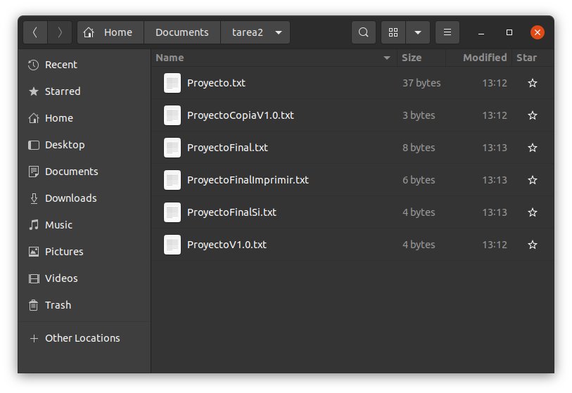
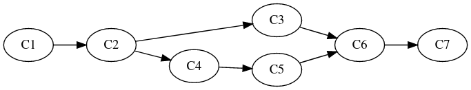
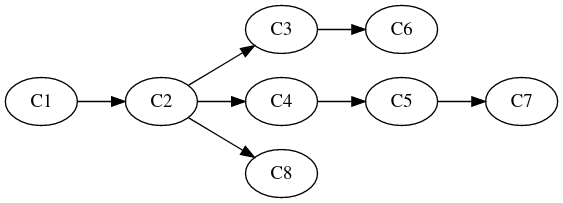

# Mis apuntes sobre Git

## Introducción

Este documento tiene como objetivo conocer qué es Git, cómo trabaja, un ejemplo de su aplicación y algunos comandos básicos que debes tener presentes.

---

## Prerequisitos

Para poder replicar los ejemplo que se brinda en este documento es indispensable tener Git instalado, a continuación una guía fácil para instalarlo según tu sistema operativo. [Guía de instalación](https://git-scm.com/book/en/v2/Getting-Started-Installing-Git).

1. Verificando Git

Para poder verificar si Git se encuentra instalado, se deber ir a la consola o terminal del sistema operativo y ejecutar el siguiente comando.


```python
%sx git --version
```


    ['git version 2.25.1']


**_Nota_**: todos los comandos estarán precedidos por **%sx**, la cual es un _"magic command"_, y nos servirá para ejecutar comandos en el sistema operativo desde este Jupyter Notebook, pero si los comandos los ejecutamos directamente desde la terminal del sistema operativo no es necesario **%sx**. Para más información de [_"magic command"_](https://jakevdp.github.io/PythonDataScienceHandbook/01.03-magic-commands.html).

2. Inicializando git en nuestro proyecto


```python
%sx git init
```


    ['Initialized empty Git repository in /home/ds/Documents/tarea2/.git/']


3. Realizar el primer **commit**


```python
%sx git add .
```


    []


```python
%sx git commit -a -m "Commit inicial"
```


    ['[master (root-commit) b271404] Commit inicial',
     ' 3 files changed, 146 insertions(+)',
     ' create mode 100644 .gitignore',
     ' create mode 100644 images/sinGit.png',
     ' create mode 100644 tarea2.ipynb']


---

## Git

Es un software de código abierto para el control de versiones con enfoque en el desarrollo de software y trabajo en equipo (sistema de control de versiones). El control de versiones es la gestión de los cambios que se van haciendo a lo largo del tiempo de un producto (para este caso software) por un equipo de trabajo o de forma individual.

Git a diferencia de otros sistemas de control de versiones destaca por su arquitectura distribuida, en la que cada usuario tiene una copia completa del proyecto incluyendo todo su historial, cada copia tiene el mismo nivel y no existe repositorio central.

La siguiente imagen representa el escenario típico que cualquier persona usa comúnmente para ir versionando sus documentos o proyectos, ahora imaginemos versionar de esa manera un proyecto de desarrollo de software con un equipo de trabajo de 2, 3 o más personas. Es en ese punto que Git ayuda al control de versiones y trabajo colaborativo.



---

### Modelo de trabajo

Es importante conocer cómo Git realiza todas las operaciones en "background", para poder hacer uso adecuado y sacar ventaja de este, de lo contrario estaríamos obligados a ejecutar comandos solo por ejecutar, teniendo un conocimiento superficial de su funcionamiento.

Algunos de los componentes principales del modelo de trabajo de Git que puedo mencionar son:

#### Snapshots (Commits) y su flujo de control

Un snapshot es como una fotografía que tomamos en un momento determinado, con el objetivo de capturar el estado de una situación, para este caso el estado de nuestro proyecto con todo lo que integra (archivos, directorios, entre otros). Estos snapshots son los **"Commits"**.

Con Git podemos tomar muchos snapshots de forma cronológica, lo cual nos permite modelar la historia de la evolución de nuestro proyecto y lo mejor que podemos viajar en el tiempo hacia cualquier snapshot.

Git organiza todos los snapshots usando como base un _Grafo Acíclico Dirigido (GDA)_. Veamos cómo luce un GDA:



Cada nodo representa un snapshot (Commit) del proyecto, y se puede observar que todos los snapshots están relacionados entre sí (tiene un antecesor y un predecesor, excepto el primero y último respectivamente).

También vemos que en algunos casos a partir de un snapshot (C2) se derivan dos o más caminos, a estos caminos se les denomina ramas "branches", las cuales representan líneas o versiones independientes de desarrollo.

Estas ramas pueden evolucionar de forma independiente y en cierto momento unirser nuevamente a la rama principal, la rama **"Master"**.

#### Master y HEAD
Es común encontrar estos términos en Git, como vimos en la sección anterior **Master** hacer referencia a la rama principal de desarrollo, de la cual pueden derivar otras ramas que más adelante pueden o no integrarse a la rama principal.

Ahora imaginemos el siguiente escenario:



Vemos que a partir de snapshot C2, se derivan 3 ramas (branches), ¿en dónde estamos ahora en la historia de nuestro proyecto? para esto sirve la referencia especial denominada **"HEAD"**, la cual apunta al lugar exacto (branch y commit) en donde me encuentro actualmente.

¿En dónde está nuestro proyecto de ejemplo?


```python
%sx git log --oneline --decorate
```


    ['b271404 (HEAD -> master) Commit inicial']


Según el **HEAD** estamos en el snapshot identificado con el Hash **b271404** en la rama **master**

#### Área de preparación (staging)
Esta área es importante y es previa a tomar un snapshot (commit). Su función es preparar y separar los archivos o directorios que van a ser incluidos en el próximo snapshot.

La secuencia para tomar un snapshot es:

1. Preparar los archivos y directorios
```
git add <files>
```
2. Realizar el commit
```
git commit <options>
```

---

## Escenario ejemplo

Es momento de poner en práctica la teoría y para esto ya tenemos que tener los prerequisitos realizados. Veamos cómo está nuestro directorio.


```python
%sx ls -al
```


    ['total 28',
     'drwxrwxr-x 5 ds ds 4096 feb  6 14:24 .',
     'drwxr-xr-x 6 ds ds 4096 feb  6 13:11 ..',
     'drwxrwxr-x 8 ds ds 4096 feb  6 15:25 .git',
     '-rw-rw-r-- 1 ds ds   20 feb  6 14:19 .gitignore',
     'drwxrwxr-x 2 ds ds 4096 feb  6 15:20 images',
     'drwxrwxr-x 2 ds ds 4096 feb  6 13:49 .ipynb_checkpoints',
     '-rw-rw-r-- 1 ds ds 3906 feb  6 14:23 tarea2.ipynb']


```python
%sx git status
```


    ['On branch master', 'nothing to commit, working tree clean']


Se puede observar el estado del proyecto:
* El proyecto compuesto por un archivo .ipynb y un directorio images
* El estatus del versionamiento según git es que no existe ningún cambio pendiente

Con la información anterior puedo indicar que el proyecto actualmente está en un snapshot "commit", listo para hacer operaciones sobre este. Ahora supungamos que nos solicitan realizar cambios sobre nuestro archivo **.ipynb**, pero es necesario darle seguimiento.

Un posible forma de resolverlo podría ser:
1. Crear una rama a partir del snapshot actual que se llame **"cambios"**, la cual nos permitirá tener una línea de desarrollo independiente de la rama **master**
2. Hacemos los cambios en el archivo **.ipynb**, los pasamos al staging area y hacemos commit
3. Fusionar (merge) la rama **cambios** a la **master**
4. Revisamos el estado de nuestro proyecto.


```python
%sx git checkout -b "cambios"
```


    ["Switched to a new branch 'cambios'"]


Se creó la rama y automáticamente git la coloca como rama en la cual se estará trabajando. A manera de observar la ramas que existen en nuestro proyectos ejecutamos el siguiente comando:


```python
%sx git branch
```


    ['* cambios', '  master']


Existen dos ramas **cambios** y **master**, y vemos que la rama cambios tiene un \* lo que significa que nos encontramos en esta rama.

A continuación se realizan un conjunto de cambios sobre el archivo **.ipynb** y se observan con el siguiente comando:


```python
%sx git status
```


    ['On branch cambios',
     'Changes not staged for commit:',
     '  (use "git add <file>..." to update what will be committed)',
     '  (use "git restore <file>..." to discard changes in working directory)',
     '\tmodified:   tarea2.ipynb',
     '',
     'no changes added to commit (use "git add" and/or "git commit -a")']


Se procede a preparar el archivo al staging area


```python
%sx git add .
```


    []


Se toma el snapshot (Commit)


```python
%sx git commit -m "Modificación del archivo .ipynb"
```


    ['[cambios 4e5ff1e] Modificación del archivo .ipynb',
     ' 1 file changed, 277 insertions(+), 11 deletions(-)']


Verificamos que el commit se haya realizado


```python
%sx git log --oneline --decorate
```


    ['4e5ff1e (HEAD -> cambios) Modificación del archivo .ipynb',
     'f856b90 (master) Redacción de contenido de notebook',
     'b271404 Commit inicial']


En efecto se realizó el **commit** en la rama **cambios** que es a donde apunta el **HEAD**.

Por último regresamos a la rama master:


```python
%sx git checkout master
```


    ["Switched to branch 'master'"]


Fusionar (merge) a la rama **master** los cambios de la rama **cambios**:


```python
%sx git merge cambios
```


    ['Updating f856b90..4e5ff1e',
     'Fast-forward',
     ' tarea2.ipynb | 288 ++++++++++++++++++++++++++++++++++++++++++++++++++++++++---',
     ' 1 file changed, 277 insertions(+), 11 deletions(-)']


Este mensaje de salida que nos da Git significa que se ha realizado un merge Fast-forward. Para más información sobre los tipos de merge visitar [Fusionar ramas](https://git-scm.com/book/es/v2/Ramificaciones-en-Git-Procedimientos-B%C3%A1sicos-para-Ramificar-y-Fusionar).

Se revisa el estado del Proyecto:


```python
%sx git log --oneline --decorate
```


    ['4e5ff1e (HEAD -> master, cambios) Modificación del archivo .ipynb',
     'f856b90 Redacción de contenido de notebook',
     'b271404 Commit inicial']


El resultado indica que el **HEAD** está apuntado a dos ramas: **master** y **cambios**, lo cual significa que estas dos ramas se han fusionado. Un práctica común es eliminar la rama (en este caso cambios) que se usó para hacer los cambios, dejando siempre el master com único y el HEAD apuntado a esta.


```python
%sx git branch -d "cambios"
```


    ['Deleted branch cambios (was 4e5ff1e).']


Nuevamente se ve el estado del Proyecto


```python
%sx git log --oneline --decorate
```


    ['4e5ff1e (HEAD -> master) Modificación del archivo .ipynb',
     'f856b90 Redacción de contenido de notebook',
     'b271404 Commit inicial']


Ahora el **HEAD** apunta a la rama **master**, la cual es la única que existe en este punto.

---

## Algunos comandos básicos

Git tiene un conjunto grande de comando y estos muchas opciones, por lo cual es recomendable hacer uso de la [documentación oficial](https://git-scm.com/doc), también puede ver la la ayuda de git en la línea de comandos

```
git help
```
o
```
man git
```

Dentro de los comando que considero que son básicos conocer propongo:
* **git init**: para inicializar git en un proyecto, activar el modo control de versión.
* **git status**: para verificar el estado del proyecto. (Este se utiliza demasiado).
* **git add \<files>**: para agregar los archivos o directorios al staging area.
* **git commit**: para tomar el snapshot.
* **git log**: para mostrar el historial en formato plano. Una sugerencia es usar este comando **git commit --all --graph --decorate** para ver el historial de una forma más amigable.
* **git branch \<name>**: para crear una rama.
* **git checkout \<nameOfBranch>**: para cambiarme de rama.
* **git merge \<fromBranch>**: para fusionar una rama con la rama actual.

Como lo indiqué antes, hay muchos más comando y para ello consultar la documentación oficial.

---

## Conclusiones

Git nos puede apoyar en la organización del código de software, manejar el historial de cambios y por ende su evolución, navegando entre las diferentes versiones y creando nuevos ambientes de trabajo a partir del origen por medio de ramas (branches). Así mismo con Git podemos tener un trabajo colaborativo, en donde varias personas están trabajando sobre el mismo software y todos necesitan estar sincronizados.

---

## Autor

**Edgar Sabán** - *19012631* - [Github](https://github.com/ticosabrax/)

---

## Referencias

Para la redacción de este notebook se consultó:
* [The Missing Semester of Your CS Education](https://missing.csail.mit.edu/2020/version-control/)
* [Sitio oficial de Git](https://git-scm.com/doc)
